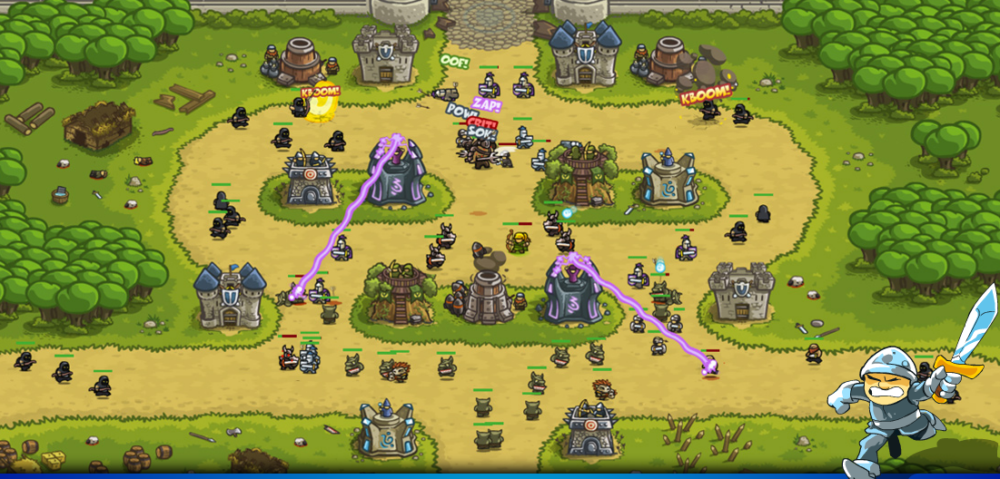
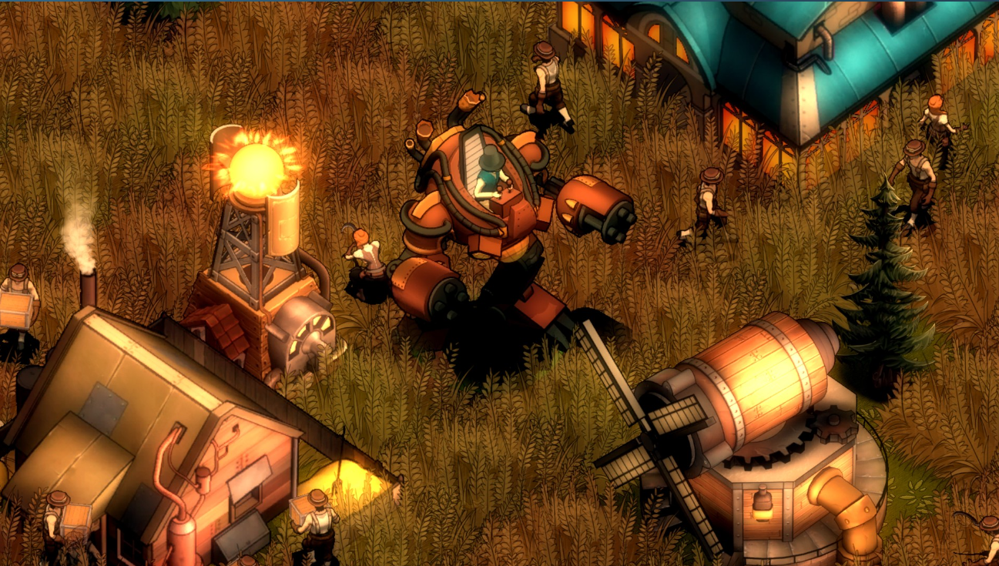
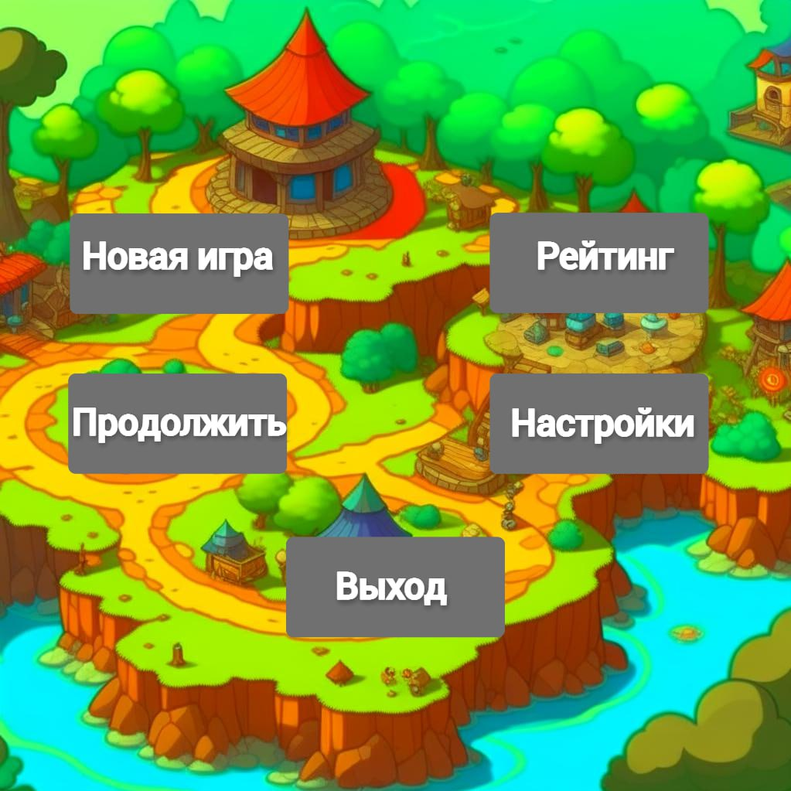
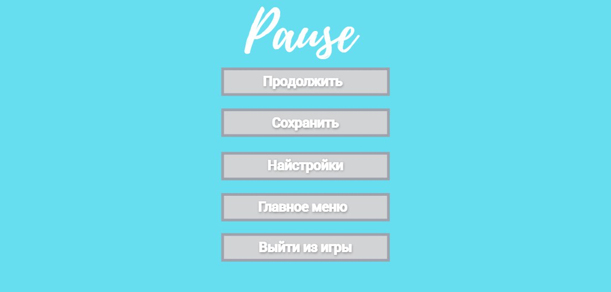

# Игра "Tower defense"
---

# Содержание

1. [Введение](#intro)  
   1.1 [Назначение](#appointment)  
   1.2 [Бизнес-требования](#business_requirements)  
   1.2.1 [Исходные данные](#initial_data)  
   1.2.2 [Возможности бизнеса](#business_opportunities)  
   1.2.3 [Границы проекта](#project_boundary)  
   1.3 [Аналоги](#analogues)  
   1.3.1 [Kingdom Rush](#Kingdom_Rush)  
   1.3.2 [They Are Billions](#They_Are_Billions)  
2. [Требования пользователя](#user_requirements)  
   2.1 [Программные интерфейсы](#software_interfaces)  
   2.2 [Интерфейс пользователя](#user_interface)  
   2.3 [Характеристики пользователей](#user_specifications)  
   2.3.1 [Аудитория приложения](#application_audience)  
   2.3.2.1 [Целевая аудитория](#target_audience)  
   2.4 [Предположения и зависимости](#assumptions_and_dependencies)
3. [Системные требования](#system_requirements)  
   3.1 [Функциональные требования](#functional_requirements)  
   3.1.1 [Основные функции](#main_functions)  
   3.1.1.1 [Начало/Продолжение игры](#start_continue_game)  
   3.1.1.2 [Настройка профиля активного пользователя](#setting_up_game_settings)  
   3.1.1.3 [Добавление записей](#save_game)  
   3.1.2 [Ограничения и исключения](#restrictions_and_exclusions)  
   3.2 [Нефункциональные требования](#non-functional_requirements)  
   3.2.1 [Атрибуты качества](#quality_attributes)  
   3.2.2 [Ограничения](#restrictions)

# 1 Введение

## 1.1 Назначение

Этот документ предназначен для описания игры "Tower Defense". Он содержит информацию о бизнес-требованиях, аналогах, программных интерфейсах, интерфейсе пользователя, характеристиках пользователей, предположениях и зависимостях.

<a name="business_requirements"/>

## 1.2 Бизнес-требования

<a name="initial_data"/>

### 1.2.1 Исходные данные

Игра "Tower Defense" разрабатывается с целью создания увлекательного и стратегического игрового опыта для целевой аудитории, предоставляя разнообразные уровни, башни и волны врагов.

<a name="business_opportunities"/>

### 1.2.2 Возможности бизнеса

Игра предоставляет возможности для монетизации через продажу приложения, внутриигровых покупок, рекламу или подписки.

<a name="project_boundary"/>

### 1.2.3 Границы проекта

Проект ограничивается разработкой и поддержкой игры "Tower Defense" для определенных платформ (мобильные устройства, веб-браузеры, платформы для ПК) и включает в себя основные функциональные и нефункциональные требования.

<a name="analogues"/>

## 1.3 Аналоги

<a name="Kingdom_Rush"/>

## 1.3.1 Kingdom Rush

**Страница в Google play:** https://play.google.com/store/apps/details?id=com.ironhidegames.android.kingdomrush&hl=en_US
**Русский интерфейс:** есть

Kingdom Rush - это популярная серия башенной обороны (tower defense) игр, созданная и разработанная студией Ironhide Game Studio. Игры этой серии предоставляют игрокам возможность строить и улучшать оборонительные башни, чтобы защитить свое королевство от нашествия врагов. Серия Kingdom Rush включает в себя несколько частей.

<a name="They_Are_Billions"/>

## 1.3.2 They Are Billions
**Страница в Steam:** https://store.steampowered.com/app/644930/They_Are_Billions/  
**Русский интерфейс:** есть

"They Are Billions" - это стратегическая компьютерная игра, разработанная и выпущенная студией Numantian Games. Игра была выпущена в раннем доступе в 2017 году и быстро приобрела популярность благодаря своему уникальному подходу к жанру стратегии в реальном времени (RTS).Главная идея "They Are Billions" заключается в том, что игроки должны строить и управлять колонией в постапокалиптическом мире, населенном зомби. Игра комбинирует элементы стратегии, обороны и выживания. Игрокам необходимо строить и улучшать свою базу, разрабатывать технологии, собирать ресурсы и создавать армию, чтобы защититься от бесчисленных волн инфицированных зомби. Одной из ключевых особенностей игры является наличие "биллионов" зомби на карте, что делает ее особенно сложной и требующей стратегического мышления.

<a name="user_requirements"/>

# 2 Требования пользователя

<a name="software_interfaces"/>

## 2.1 Программные интерфейсы

Игра будет писаться языке Python с использованием библиотеки pygame.

<a name="user_interface"/>

## 2.2 Интерфейс пользователя

Главное меню игры.

В главном меню есть 5 кнопки:
1. При нажатии на кнопку "Новая игра" запускается начало игры.
2. При нажатии на кнопку "Продолжить" игрок переходит в меню выбора предыдущих сохранений.
3. При нажатии на кнопку "Рейтинг" открывается рейтинг предыдущих игр.
4. При нажатии на кнопку "Настройки" игрок преходит в настройки игры.
5. При нажатии на кнопку "Выйти из игры" окно игры закрывается.

После запуска игры начинается сам игровой процесс. 

У игрока есть возможность открывать меню выбора построек башен, в котором можно выбирать разные башни, и ставить их в определенные, для них, места.

В процессе игры будут появлятся волны с разными врагами.
Враги будут разных типов и видов.
1. Невидимые
2. Летающие
3. Ходящие
4. Видимые

В любой момент игры возможен переход в меню паузы по нажатию клавиши ESC.

В меню паузы есть 5 кнопок:
1. При нажатии на кнопку "Продолжить" игровой процесс продолжается.
2. При нажатии на кнопку "Сохранить" игрок может сохранить текущий процесс игры.
3. При нажатии на кнопку "Настройки" игрок переходит в настройки игры.
4. При нажатии на кнопку "Главное меню" игрок переходит в главное меню игры.
5. При нажатии на кнопку "Выйти из игры" окно игры закрывается.

<a name="user_specifications"/>

## 2.3 Характеристики пользователей

<a name="application_audience"/>

### 2.3.1 Аудитория приложения

<a name="target_audience"/>

#### 2.3.2.1 Целевая аудитория

Целевая аудитория включает в себя игроков в возрасте от 12 лет и старше, заинтересованных в стратегических и захватывающих играх.

<a name="assumptions_and_dependencies"/>

## 2.4 Предположения и зависимости

Требования к системе могут меняться в зависимости от уровня оптимизации, размера игры и количества уникального контента.

<a name="system_requirements"/>

# 3 Системные требования

<a name="functional_requirements"/>

## 3.1 Функциональные требования

<a name="main_functions"/>

### 3.1.1 Основные функции

1. Построение башни.
2. Выбор башни.
3. Удаление башни.
4. Заморозка врагов.

<a name="start_continue_game"/>

#### 3.1.1.1 Начало/Продолжение игры

1. Возможность начать новую игру.
2. Сохранение текущего прогресса и возможность продолжить игру позже.

<a name="setting_up_game_settings"/>

#### 3.1.1.2 Настройка параметров игры

1. Создание и управление профилем игрока.
2. Возможность настройки уровня сложности.

<a name="save_game"/>

#### 3.1.1.3 Добавление записей

1. Ведение статистики и рейтинга игроков.
2. Возможность делиться результатами с друзьями.

<a name="restrictions_and_exclusions"/>

### 3.1.2 Ограничения и исключения

1. Игра не предоставляет возможности многопользовательской игры в режиме реального времени.
2. Не предусматривается поддержка сторонних модификаций.

<a name="non-functional_requirements"/>

## 3.2 Нефункциональные требования

<a name="quality_attributes"/>

### 3.2.1 Атрибуты качества

Важно, чтобы игра имела качественную и привлекательную графику, которая создает уникальную атмосферу. Это может включать в себя детализацию башен и врагов, освещение, эффекты.

<a name="restrictions"/>

### 3.2.2 Ограничения

1. Игра должна поддерживать минимальные требования системы для выбранной платформы.
2. Ограничения по возрастным рейтингам должны быть соблюдены в соответствии с региональными стандартами.